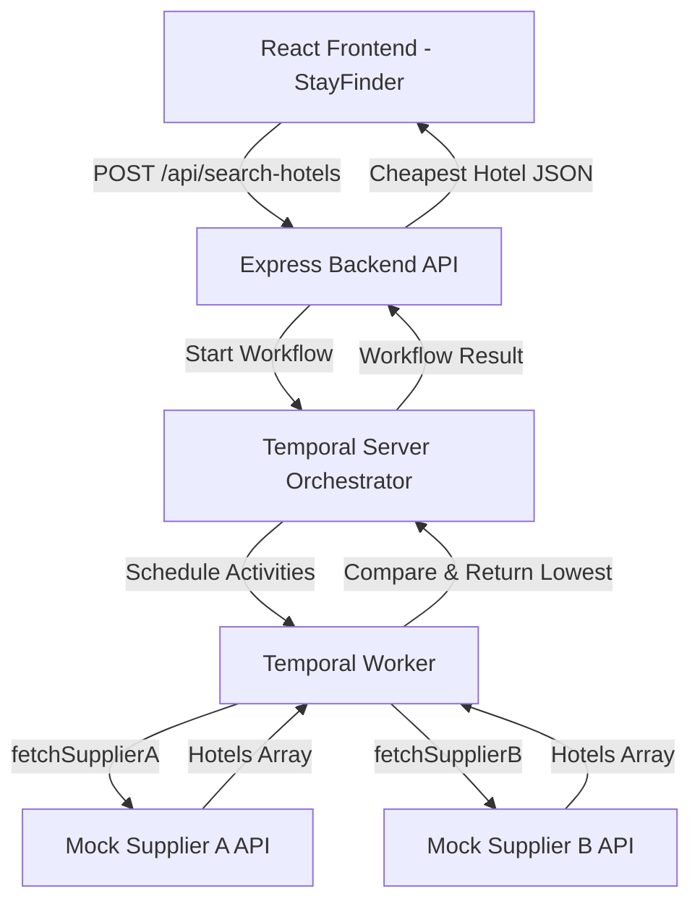

# Hotel Rate Comparator using Temporal Workflows

A resilient full-stack application built with **Node.js, TypeScript, Express, Temporal SDK, and React** that finds the best hotel rate across multiple mock suppliers while handling delays, timeouts, retries, and network errors gracefully.

---

## Architecture Overview



---

## Backend Directory Structure & Layered Architecture

The backend follows the industry-standard **Routes &rarr; Controllers &rarr; Services** layered pattern:

```
backend/src/
├── app.ts                  # Express application setup, middlewares, and route mounting
├── server.ts               # Server lifecycle listener & port binding
├── routes/                 # Pure HTTP routing definitions
│   ├── index.ts            # Root router aggregating all sub-routes
│   ├── hotel.routes.ts     # POST /api/search-hotels route
│   └── supplier.routes.ts  # GET /supplierA/hotels & GET /supplierB/hotels routes
├── controllers/            # Request parsing, HTTP validation, status code mapping
│   ├── hotel.controller.ts # Hotel search request/response lifecycle & abort handling
│   └── supplier.controller.ts # Mock supplier HTTP handling
├── services/               # Core application & orchestration business logic
│   └── hotel.service.ts    # Temporal workflow invocation, client management, cancellation hooks
├── temporal/               # Temporal distributed orchestration
│   ├── activities/         # External I/O with cancellation signal integration
│   │   └── hotel.activities.ts
│   ├── workflows/          # Deterministic business logic, parallel fanout, timeouts
│   │   └── hotel.workflow.ts
│   ├── client.ts           # Singleton Temporal client connection
│   └── worker.ts           # Dedicated worker process for task queue "hotel-search"
├── suppliers/              # Vendor data source simulation
│   ├── supplierA.ts        # Supplier A behaviors (delay, timeout, error, fail-twice)
│   └── supplierB.ts        # Supplier B behaviors
└── types/                  # Shared TypeScript interfaces & types
    └── hotel.ts
```

---

## Tech Stack

- **Frontend**: React 18, TypeScript, Vite, Tailwind CSS, Lucide React
- **Backend**: Node.js, TypeScript, Express 5, `@temporalio/client`, `@temporalio/worker`, `@temporalio/workflow`, `@temporalio/activity`
- **Orchestration**: Temporal.io
- **Testing**: Jest, `ts-jest`, Supertest

---

## Prerequisites

1. **Node.js** (v18.x or v20.x+)
2. **Docker** (for local Temporal server)
3. **npm**

---

## Setup & Running Instructions

### 1. Start the Temporal Server

Using Docker Compose:
```bash
docker run -d --name temporal -p 7233:7233 -p 8233:8233 temporalio/temporal:latest server start-dev --ip 0.0.0.0
```
- Temporal gRPC endpoint: `localhost:7233`
- Temporal Web UI: `http://localhost:8233`

---

### 2. Install Dependencies

From the project root:
```bash
npm install --prefix backend
npm install --prefix frontend
```

---

### 3. Run the Services

You can start each service in a separate terminal:

#### Terminal 1: Backend Express Server
```bash
npm run backend
# Runs on http://localhost:3000
```

#### Terminal 2: Temporal Worker
```bash
npm run worker
# Listens on task queue: hotel-search
```

#### Terminal 3: Frontend Application
```bash
npm run frontend
# Opens on http://localhost:5173
```

---

## Testing

Run the full Jest test suite from the project root or inside `backend/`:

```bash
npm test
```

Or watch mode:
```bash
npm --prefix backend run test:watch
```

---

## Scenario Coverage Matrix

| Category | Scenario | Expected Behavior | Test File |
|---|---|---|---|
| **Basic** | Supplier A cheaper | Picks and returns Supplier A's rate | `workflow.test.ts` |
| **Basic** | Supplier B cheaper | Picks and returns Supplier B's rate | `workflow.test.ts` |
| **Basic** | Both return same rate | Deterministically picks Supplier A | `workflow.test.ts` |
| **Basic** | Supplier A fails, B succeeds | Resiliently returns Supplier B's rate | `workflow.test.ts`, `api.test.ts` |
| **Basic** | Both suppliers fail | Throws non-retryable error & returns HTTP 500 | `workflow.test.ts`, `api.test.ts` |
| **Basic** | One returns empty | Returns the valid available result | `workflow.test.ts` |
| **Basic** | Both return empty | Returns HTTP 500 `{"error": "No hotels found"}` | `workflow.test.ts`, `api.test.ts` |
| **Advanced** | One supplier takes > 5s | Activity times out at 5s (`startToCloseTimeout`), proceeds with other supplier | `hotel.workflow.ts`, `activities.test.ts` |
| **Advanced** | Supplier A fails 2x | Temporal activity retry policy retries twice and succeeds on attempt 3 | `suppliers.test.ts`, `api.test.ts` |
| **Advanced** | User cancels mid-way | Frontend aborts HTTP request via `AbortController`; backend cancels workflow via `handle.cancel()` | `server.ts`, `hotelApi.ts`, `App.tsx` |

---

## API Documentation

### 1. Hotel Search Endpoint
- **URL**: `POST http://localhost:3000/api/search-hotels`
- **Request Body**:
  ```json
  {
    "city": "Delhi",
    "checkIn": "2026-09-15",
    "checkOut": "2026-09-18",
    "supplierABehavior": "normal",
    "supplierBBehavior": "normal"
  }
  ```
- **Success Response (200 OK)**:
  ```json
  {
    "hotelId": "hotel-1",
    "name": "Taj Hotel",
    "price": 4500
  }
  ```
- **Error Response (500 Internal Server Error)**:
  ```json
  {
    "error": "No hotels found"
  }
  ```

### 2. Mock Supplier Endpoints
- **Supplier A**: `GET http://localhost:3000/supplierA/hotels?behavior={normal|delay|timeout|empty|error|fail-twice}`
- **Supplier B**: `GET http://localhost:3000/supplierB/hotels?behavior={normal|delay|timeout|empty|error}`

---

## Assumptions and Known Limitations

1. **Supplier B Rates**: In the mock data, Supplier B offers lower rates (₹4,500 vs ₹5,000 for Taj Hotel), so Supplier B is chosen when both return normal rates.
2. **Fail-Twice Counter**: The `fail-twice` counter is stored in-memory in the backend process and automatically resets after the 3rd successful attempt.
3. **Local Supplier URLs**: The activities query `http://localhost:3000`. In production, supplier endpoints would be read from environment variables (`SUPPLIER_A_URL`, `SUPPLIER_B_URL`).
4. **Temporal Cluster**: Assumes a local Temporal cluster is available on `localhost:7233`.


